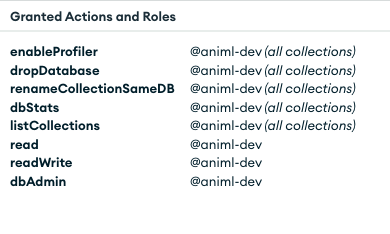

### Setting up MongoDB

1. Subscribe to the `MongoDB Atlas (pay-as-you-go)` service in the AWS console via
the AWS Marketplace (e.g. https://us-east-1.console.aws.amazon.com/marketplace/search).
Search for `MongoDb Atlas` and create a subscription.
After subscribing, a link `Setup your account` will take you to the
vendor's website (https://account.mongodb.com/).

1. Follow the `Don't have a MongoDB account yet?` Sign up here [https://account.mongodb.com/account/register](https://account.mongodb.com/account/register) to complete linking your AWS
account to MongoDB, and you have to confirm your account via email.

1. Create an organization within the MongoDB Atlas service by viewing your `Organizations`
and clicking `Create New Organizaion` and choosing the `MongoDB Atlas` cloud service.
Next step would be to link your newly created organization to your AWS account
for billing, and we recommend linking them via the AWS Marketplace.

1. Create a new project by going to `All Projects` and clicking `New Project`.
From there, you should just need to name your project.

1. Create a new cluster instance in your newly created project to be used for record
storage. At this point you will need to choose the cluster plan depending on how
heavy usage you are expecting. We recommend starting with the free tier to test
and monitor your usage before upgrading to a higher tier at a later date. Then, you might provide payment information if you choose a paid tier. As an example,
the production instance of [animl.camera](https://animl.camera/) runs on the M30 plan. At this
stage you must also choose which cloud provider and region you wish to deploy your
cluster to, and we curretly only support AWS deployments to the `us-west-2` region. You can set the cluster name, if you don't it defaults to ```cluster0``` if this is your first cluster.

1. Creation of the cluster will automatically create an admin database user with a role already assigned. Please don't use this user for connecting the ```animl-api``` application to the database. Rather create a new database user with a custom role. Start by creating the custom role. Custom roles can be created in your project's settings by following `Security -> Database & Network Access -> Custom Role`. For now, we assume that your database will be called ```animl-dev``` if you use a different name you have to adapt the values below accordingly. We defer the creation of the database itself to the ```seedDb.js``` script that will be run at the very end of the database initialization process. Nevertheless, we will need the database name already to define the role permissions. Following permissions are required:

    

2. After the custom role is created, go to  `Security -> Database & Network Access
-> Database Users` and create a unique database user for ```animl-api``` to access the database. Choose user/password authentication. Attach the custom role you created to this new user and note down this new user's name and password for the next step.

    

    **Please note that a database user is distinct from a MongoDB Atlas user, although the first database user automatically created is named after your MongoDB Atlas username. A database user is a set of credentials to access a database in your cluster, whereas the latter is to access your MongoDB Atlas account which can have access to multiple organizations or clusters.**

1. You can now construct the connection string for the application using the new database user, their password, and the name of the database to to be created. Again, the database itself will be created by the ```seedDb.js``` script from the information you provide in the connection string.

2. A connection string is a url directed at your MongoDB cluster that will allow ```animl-api``` to query and write to the appropriate database. To access the connection string, click on the `Connect` button from the cluster overview page, and choose the `Compass` option. When you click `I have MongoDB Compass installed`, the second step should have your connection string. Then replace the `db_username` and `db_password` with the credentials from the DB User created in the previous step. The connection string should look something like this, where there are some random letters instead of the stars:

    ```
    mongodb+srv://<db_username>:<db_password>@cluster0.********.mongodb.net/
    ```

    You further need to modify this string by adding the database name, we decided on when we created the custom role, ```animl-dev``` in our example. We also recommend adding some extra url parameters to the connection string for better performance. So the complete connection string should look something like this (cluster name is ```cluster0``` in the example):

    ```
    mongodb+srv://<db_username>:<db_password>@cluster0.********.mongodb.net/animl-dev?retryWrites=true&w=majority
    ```


3. Enable IP address access to your DB in your projects settings via `Security` -> `Database & Network Access` -> `IP Access List`. To test the connectivity you can enable your specific IP address, but to fully deploy an animl instance, you will need to enable all IPs  by adding `0.0.0.0/0` to your `IP Access List` (this is what we currently do,
but we can relook at this in the future).

1.  At this point you can now test the DB and its connectivity by seeding the DB via [seedDb.js](../src/scripts/seedDb.js) script. This can be done by running
    ```
    npm run seed-db-dev
    # or, do seed the production db:
    npm run seed-db-prod
    ```
    Make sure that the correct credentials are stored in an AWS_PROFILE called ```animl``` on your machine. Unfortunately, the use of that profile is currently hard-wired.

    This script will create the database as well as some example projects and the records for some example ML Models.

    For more instructions [here](../README.md#seeding-db). .
